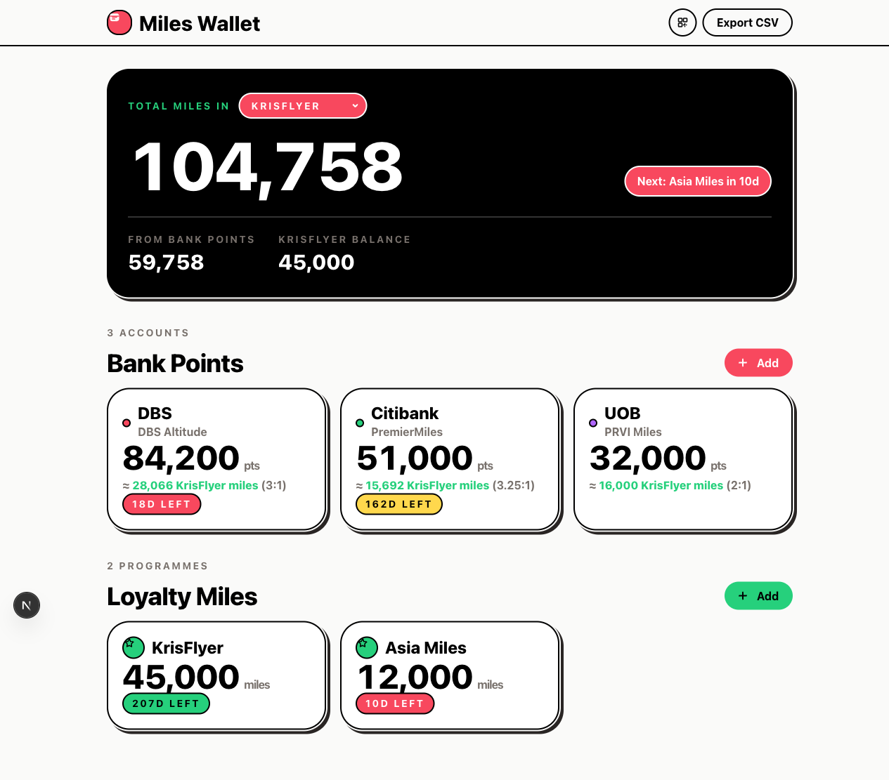

# Miles Wallet


[](https://agentready.davidcjw.com/results/davidcjw/miles-wallet)

A bold web app for tracking bank credit card points and loyalty programme miles — all in one place, stored locally in your browser.

**Live:** https://miles-wallet.davidcjw.com

<p align="center">
  
</p>

## Features

- **Programme Selector** — Choose a loyalty programme (KrisFlyer, Asia Miles, Enrich Miles, Avios, Flying Blue) and see all your bank points converted to it in real time
- **Bank Points** — Add multiple bank accounts (Bank, Card Name, Points, Expiry); conversion rates auto-applied from a built-in lookup table for 8 SG banks
- **Loyalty Miles** — Track direct miles balances (e.g. KrisFlyer, Asia Miles) with expiry dates
- **Total Miles Dashboard** — Hero card showing total miles equivalent (bank conversions + loyalty balance) for the selected programme
- **Expiry Alerts** — Color-coded expiry pills (green → yellow → coral as expiry approaches)
- **Bold Design System** — Built on [`rawhouse-ds`](https://github.com/davidcjw/rawhouse-ds): chunky sticker-shadow cards, Manrope display type, coral + green accents
- **CSV Export** — Download all your data as a spreadsheet
- **QR Sync** — Generate a QR code on one device and scan it on another to transfer your wallet data
- **Installable PWA** — Add it to your home screen and launch it like a native app. A service worker caches the app shell, so your wallet keeps working fully offline
- **Zero backend** — All data lives in your browser's `localStorage`; nothing is sent to any server

## Tech Stack

- **Next.js 16** (App Router)
- **React 19**
- **Tailwind CSS v4** (layout utilities)
- **[rawhouse-ds](https://github.com/davidcjw/rawhouse-ds)** design system (tokens, Manrope, UI primitives)
- **TypeScript**

## Getting Started

```bash
npm install
npm run dev
```

Open [http://localhost:3000](http://localhost:3000).

> **Note:** The service worker only registers in production builds (to avoid dev HMR conflicts). To test PWA install/offline behaviour locally, run `npm run build && npm start` and open the served URL.

## Install as an App

Miles Wallet is a Progressive Web App:

- **Desktop / Android (Chrome, Edge):** an "Install Miles Wallet" prompt appears, or use the browser's install button in the address bar.
- **iOS (Safari):** tap **Share → Add to Home Screen**.

Once installed it launches standalone and works **offline** — the service worker (`public/sw.js`) precaches the app shell and caches static assets at runtime. Since all data is in `localStorage`, the full app is usable with no connection.

## Data Model

**Bank Account**

| Field | Description |
|---|---|
| `bankName` | e.g. DBS, Citibank |
| `cardName` | e.g. DBS Altitude (optional — used to segregate points within the same bank) |
| `points` | Current points balance |
| `expiryDate` | When the bank points expire (optional) |

Conversion rates are looked up automatically from `CONVERSION_RATES` in `app/lib/constants.ts` based on the globally selected loyalty programme.

**Loyalty Account**

| Field | Description |
|---|---|
| `programmeName` | e.g. KrisFlyer, Asia Miles |
| `miles` | Current miles balance |
| `expiryDate` | When the miles expire (optional) |

## Conversion Rates

Built-in rates (points per 1 mile) sourced from bank transfer partner pages:

| Bank | KrisFlyer | Asia Miles | Enrich | Avios | Flying Blue |
|---|---|---|---|---|---|
| DBS | 3 | 3 | 3 | 3 | 3 |
| OCBC | 2.5 | 2.5 | 2.5 | 2.5 | — |
| UOB | 2 | 2 | — | 2 | 2 |
| Citibank | 3.25 | 3.25 | — | 3.25 | 3.25 |
| Standard Chartered | 2.5 | 2.5 | 2.5 | 2.5 | 2.5 |
| HSBC | 2.5 | 2.5 | 2.5 | 2.5 | 2.5 |
| American Express | 2.5 | 2.5 | — | 2.5 | 2.5 |
| Maybank | 5 | 5 | — | — | — |

## Deployment

Deployed via Vercel. Push to `master` triggers automatic deployment.

## Privacy

No analytics, no tracking, no server. Your data stays in your browser.

## Contributing

Contributions are welcome! Please open an issue first to discuss what you'd like to change.

1. Fork the repo
2. Create a feature branch (`git checkout -b feature/your-feature`)
3. Commit your changes (`git commit -m 'feat: describe change'`)
4. Push and open a pull request

## Code of Conduct

This project follows the [Contributor Covenant v2.1](https://www.contributor-covenant.org/version/2/1/code_of_conduct/).
By participating you agree to uphold a welcoming, harassment-free environment.

## License

Distributed under the MIT License. See [LICENSE](LICENSE) for details.
